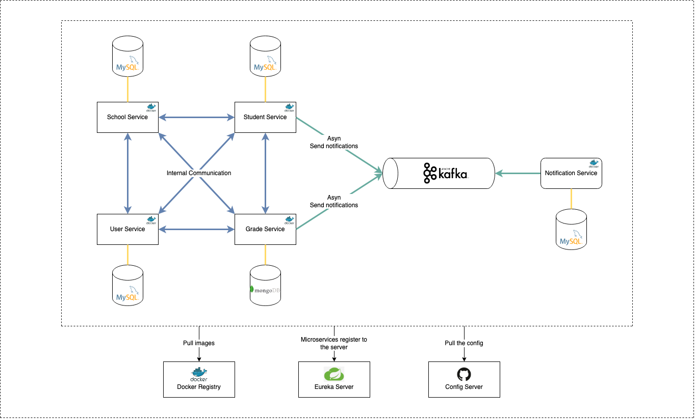

# Volet architecture applicative
:sectnumlevels: 4
:toclevels: 4
:sectnums: 4
:toc: left :icons: font
:toc-title: Sommaire

Dernière modification : {docdate}

## Introduction

Ceci est le point de vue applicatif du projet. Il décrit les modules applicatifs en jeu et leurs échanges.

Les autres volets du dossier sont accessibles link:./README.adoc[d'ici].

Le glossaire du projet est disponible link:glossaire.adoc[ici]. Nous ne redéfinirons pas ici les termes fonctionnels ou techniques utilisés.

## Contexte général

### Objectifs

====
L'application est une plate-forme conçue pour permettre le fonctionnement efficace d'un établissement scolaire grâce à la digitalisation et à l'automatisation de diverses opérations académiques et administratives.
====

## Contraintes

### Budget

====
Coûts d'infrastructure cloud < 2K€ / mois.
====

### Planning

====
MEP avant Juin 2023.
====

## Exigences

====
Le développement devra pouvoir se faire au sein d'équipes distribuées, chacune travaillant sur des modules distincts.
====

====
Le système doit être très évolutif.
====

## Architecture cible

### Architecture applicative générale

 * Le type d'architecture: Event-driven microservices.
 * La communication entre les services se fait de manière asynchrone grâce aux événements.

====
L'application est constituée de plusieurs microservices indépendants : School Service, User Service, Student Service, Grade Service.
====

